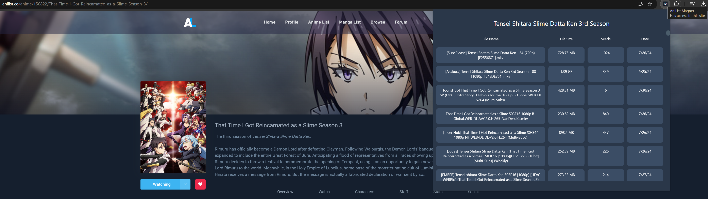

# AniList Magnet
Find Magnet URI's for AniList to easily Torrent any Anime. This may not be perfect depending on the Anime and how unpopular/old it is.

### Usage
On an Anime's page, click the extension to run it.

Click the file name for the Magnet URI you want.

### Installation
chrome://extensions/ -> Load Unpacked -> Select The Folder

### Resources
https://animetosho.org - For Finding Torrents 
https://miru.watch - Miru by ThaUnknown - Found Tosho and got the idea from this

### Sorting Priority
By Default, Sorting priority goes `From SubsPlease` -> `Episode` -> `Seeders` 
However, it may be slightly inconsistent due to naming inconsistencies, SubsPlease uses episode number, E.g. 70 instead of S3E21